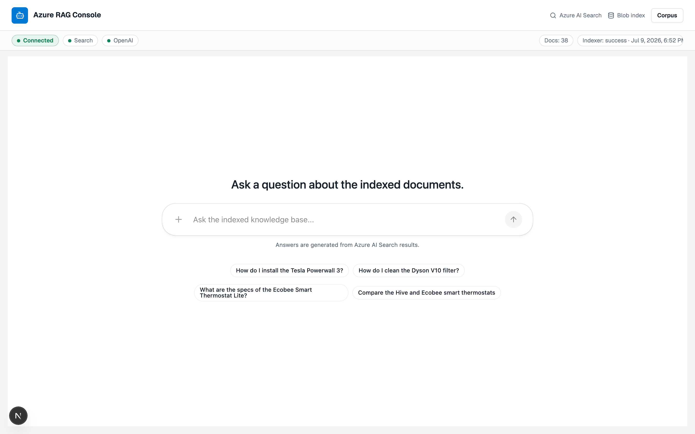
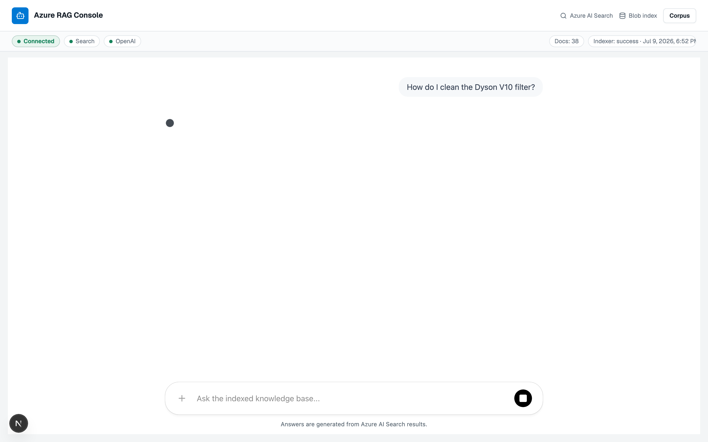
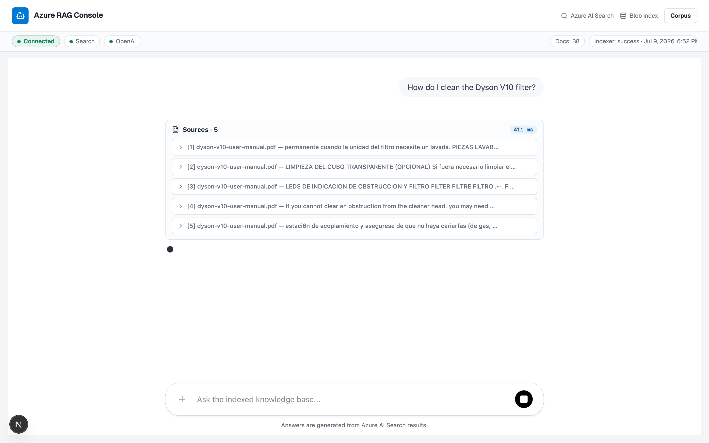
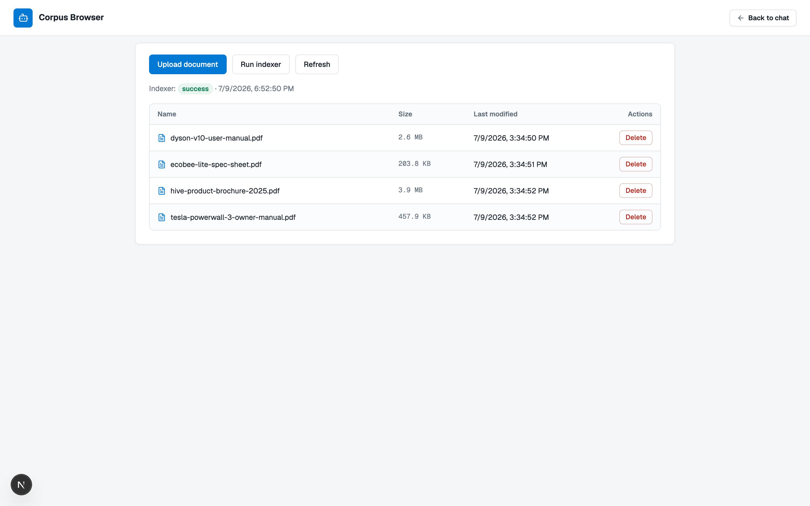
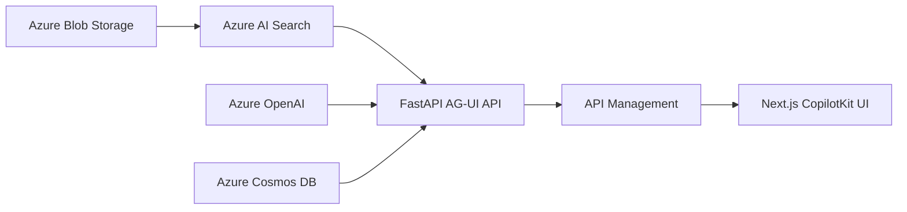

# Azure AI Search RAG Demo

A production-shaped Azure-native RAG system for grounded chat over Markdown and PDF documents. It uses Azure Blob Storage for source files, Azure AI Search for indexing and hybrid semantic retrieval, Azure OpenAI for embeddings and answers, Cosmos DB for per-user discussion history, FastAPI for AG-UI streaming, and a Next.js + CopilotKit console for the user experience.

The project is designed around managed identities, least-privilege RBAC, API Management, private backend ingress, and repeatable Bicep deployment. It is a practical reference for taking a RAG prototype past the "single script and some keys" phase.

## Demo

<video src="assets/readme/demo-overview.webm" autoplay loop muted playsinline width="100%"></video>

*Chat with grounded answers and citations, plus corpus upload, delete, and indexer controls.*

| Chat (ready) | Question + sources | Grounded answer | Corpus browser |
|---|---|---|---|
|  |  |  |  |

## What It Includes

- Azure AI Search indexing pipeline: Blob data source, skillset, chunking, embeddings, vector index, semantic ranking, and indexer controls.
- Strict per-user corpus isolation: uploads, suggestions, retrieval, and deletion are scoped to the authenticated user's `user_id`.
- Grounded answer generation through Azure OpenAI with citation-friendly retrieved sources.
- FastAPI backend exposing `/health`, `/ready`, and AG-UI `/agui` streaming.
- Per-user discussion history in Cosmos DB with reopen, rename, delete, optimistic concurrency, and 90-day inactivity expiry.
- Next.js CopilotKit console with chat, readiness gating, citations, session history, and corpus management.
- Production-style Azure deployment with Container Apps, APIM Standard v2, private API ingress, managed identities, RBAC, telemetry, and Bicep.
- Greenfield bootstrap for empty subscriptions, while still supporting manually-created Azure resources.

## Quick Start

Install dependencies:

```bash
uv sync
cd ui && npm ci && cd ..
```

Configure Azure values:

```bash
cp .env.example .env
```

Create or update the Search pipeline:

```bash
uv run python scripts/setup_azure_rag.py
```

Run locally:

```bash
uv run uvicorn azure_rag.api:app --reload
cd ui && npm run dev
```

Local history uses `SESSION_LOCAL_USER_ID=local-development-user`. Set the Cosmos endpoint, database, and container values from `.env.example`; authentication remains keyless through your Azure CLI/developer credential. The Cosmos container must use `/userId` as its partition key and a 7,776,000-second default TTL.

Run checks:

```bash
uv run pytest
cd ui && npm test && npm run lint && npm run build
```

## Deploy On Azure

For an empty subscription, bootstrap the Azure dependencies first:

```bash
./infra/setup-all.sh dev switzerlandnorth <name-prefix>
```

Or run the phases manually:

```bash
./infra/bootstrap.sh dev switzerlandnorth
./infra/setup-entra-apps.sh dev <display-name-prefix>
./infra/deploy.sh <deployment-resource-group> dev <search-resource-group> <search-service-name>
./infra/configure-ui-auth.sh dev <deployment-resource-group>
uv run python scripts/setup_azure_rag.py
```

The scripts automate Entra app setup when your signed-in identity has the required tenant permissions. Model quota/availability and Container Apps environment quotas in the selected Azure regions can still require a human/admin. See the deployment guide before running this in a real subscription.

## Documentation

| Guide | What it covers |
|---|---|
| [Architecture](docs/architecture.md) | System topology, indexing flow, query flow, components, and infrastructure boundaries |
| [Deployment](docs/deployment.md) | Prerequisites, bootstrap, Azure parameters, Entra apps, RBAC, and production deployment steps |
| [Development](docs/development.md) | Local setup, project layout, Search pipeline setup, app startup, and verification |
| [API Reference](docs/api.md) | Backend health, readiness, and AG-UI endpoints |
| [Scope and Roadmap](docs/roadmap.md) | Current limitations, delivered work, next production hardening steps, and design notes |
| [Infra README](infra/README.md) | Lower-level Bicep, APIM, networking, image, and smoke-test details |

## Architecture Snapshot



The full production topology keeps the UI public, the API private behind APIM, and service-to-service access keyless through Microsoft Entra and managed identities.
