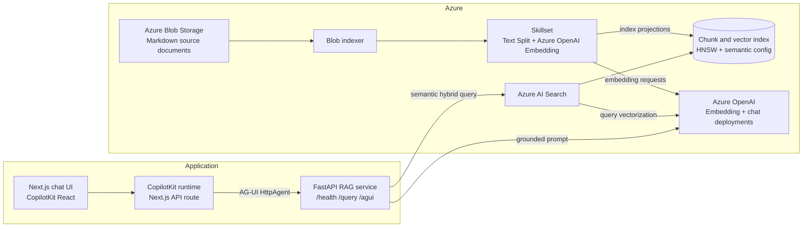
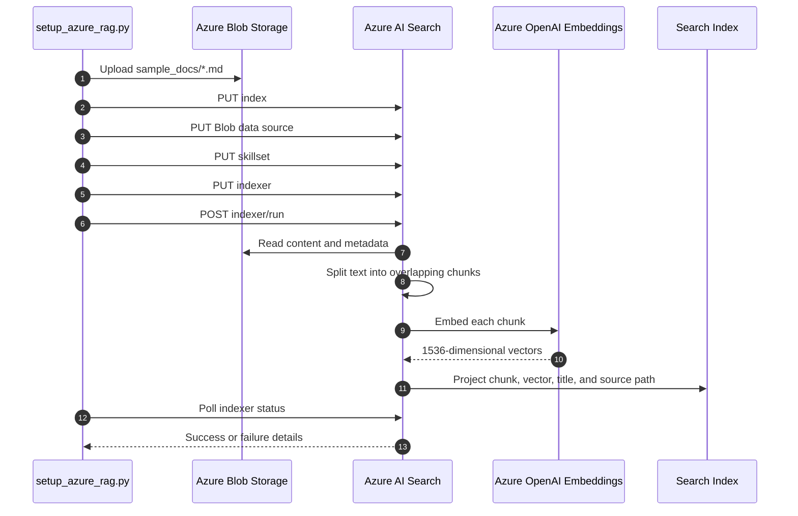
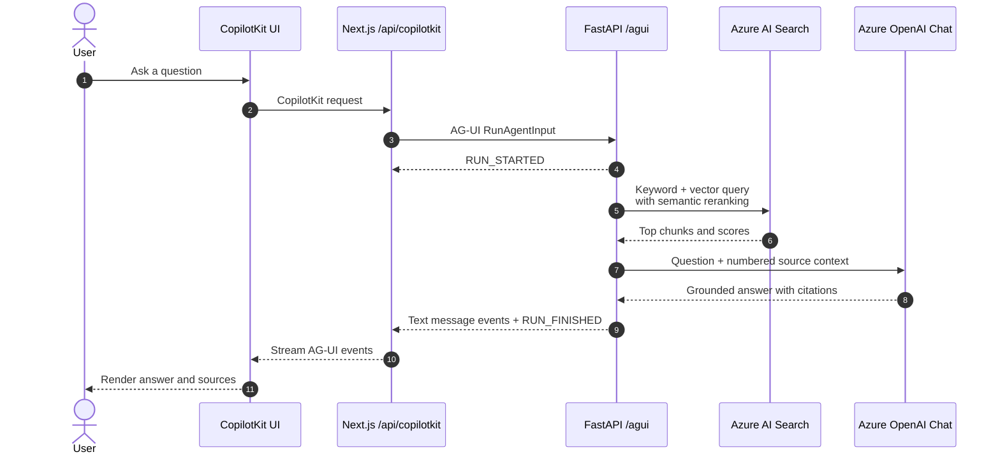

# Azure AI Search RAG Demo

An Azure-native retrieval-augmented generation (RAG) application that uses Azure AI Search for the full document retrieval pipeline: Blob ingestion, chunking, integrated embeddings, vector indexing, semantic ranking, and hybrid search. FastAPI exposes the RAG service through JSON and AG-UI endpoints, while a Next.js and CopilotKit interface provides the browser experience.

Azure service-to-service access uses managed identities and RBAC. End-user authentication is not implemented yet; see [Production Roadmap](#production-roadmap) before deploying outside a learning or development environment.

## Architecture



### Indexing flow

The setup command manages every Azure AI Search object programmatically with create-or-update operations, then starts the indexer and waits for its result.



### Query flow



## Components and Features

| Component | Implementation | Responsibility | Current features |
|---|---|---|---|
| Source storage | Azure Blob Storage | Durable source-document store | Existing container support; sample Markdown upload; overwrite on rerun |
| Search index | Azure AI Search | Stores retrievable chunks and vectors | HNSW cosine vector search; 1536 dimensions; semantic configuration; filterable source metadata |
| Data source | Azure AI Search Blob data source | Connects Search to the Blob container | High-water-mark change detection based on Blob last-modified metadata |
| Skillset | Azure AI Search integrated vectorization | Enriches documents during indexing | 1,800-character page chunks; 250-character overlap; Azure OpenAI embedding skill; index projections |
| Indexer | Azure AI Search indexer | Orchestrates Blob extraction and enrichment | Content and metadata extraction; strict zero-failure policy; status polling |
| Retrieval | `azure_rag/rag.py` | Finds grounding context | Semantic hybrid search: full-text query, integrated query vectorization, HNSW candidates, semantic reranking, captions, and answers requested from Search |
| Generation | Azure OpenAI chat deployment | Produces the final answer | Low-temperature grounded prompt; numbered citations; explicit insufficient-context behavior |
| API | FastAPI | Exposes application operations | Health check, typed JSON query API, AG-UI streaming endpoint, generated OpenAPI docs |
| Agent protocol | AG-UI | Standardizes UI-to-agent communication | Run lifecycle, text-message lifecycle, and error events over an event stream |
| Web runtime | CopilotKit runtime in Next.js | Server-side agent bridge | `HttpAgent` proxy to FastAPI; backend URL kept server-side |
| Web UI | Next.js, React, CopilotKit | Interactive test console | Responsive chat, suggested questions, answer rendering, and source display |

## Azure Resources

The application expects these resources to exist:

| Resource | Purpose | Configured value |
|---|---|---|
| Azure AI Foundry/OpenAI resource | Hosts model deployments | `kostas-demo-rag-resource` |
| Chat deployment | Grounded answer generation | `Llama-3.3-70B-Instruct` |
| Embedding deployment | Index-time and query-time vectors | `text-embedding-3-small` |
| Azure AI Search service | Indexing and retrieval | `rag-system` |
| Storage account | Hosts source Blob container | `kostasdemoragdocs21847` |
| Blob container | Stores source documents | Set with `AZURE_STORAGE_CONTAINER` |

The setup script creates the Search index, data source, skillset, and indexer. It does not provision the Azure resource group, Search service, Foundry/OpenAI resource, model deployments, storage account, or Blob container.

## Project Structure

```text
azure_rag/
  config.py           Environment configuration and derived resource names
  search_pipeline.py  Blob upload and Azure AI Search object management
  rag.py              Hybrid retrieval, prompting, and answer generation
  api.py              FastAPI routes and request/response models
  agui.py             AG-UI event adapter
sample_docs/          Sample Markdown knowledge base
scripts/
  setup_azure_rag.py  Pipeline setup entry point
tests/                Backend unit tests
ui/
  src/app/            Next.js UI, provider, and CopilotKit API route
  src/lib/            Agent URL configuration and tests
main.py               Alternate setup entry point
```

## Prerequisites

- Python 3.12 or later
- [`uv`](https://docs.astral.sh/uv/) for Python dependency and command management
- Node.js compatible with Next.js 16 and npm
- An Azure subscription with the resources listed above
- An Azure AI Search tier that supports semantic ranking
- Network access between Azure AI Search and the Azure OpenAI embedding deployment

## Configuration

Copy `.env.example` to `.env` and provide the resource endpoints, deployment names, and Azure resource ID. No API keys or storage connection strings are required:

```env
AZURE_OPENAI_ENDPOINT=https://kostas-demo-rag-resource.openai.azure.com/openai/v1
AZURE_OPENAI_CHAT_DEPLOYMENT=Llama-3.3-70B-Instruct
AZURE_OPENAI_EMBEDDING_DEPLOYMENT=text-embedding-3-small

AZURE_SEARCH_ENDPOINT=https://rag-system.search.windows.net
AZURE_SEARCH_INDEX=kostas-demo-rag-index

AZURE_STORAGE_ACCOUNT_URL=https://kostasdemoragdocs21847.blob.core.windows.net
AZURE_STORAGE_CONTAINER=sample-docs
AZURE_STORAGE_RESOURCE_ID=/subscriptions/<subscription-id>/resourceGroups/<resource-group>/providers/Microsoft.Storage/storageAccounts/kostasdemoragdocs21847
```

`AZURE_OPENAI_ENDPOINT` accepts either the Azure OpenAI resource URL or its `/openai/v1` URL. The application derives the correct URL for chat calls and Azure AI Search integrated vectorization.

`AZURE_STORAGE_ACCOUNT_URL` is used by the setup process to upload sample documents with Microsoft Entra authentication. `AZURE_STORAGE_RESOURCE_ID` is written to the Search Blob data source as a `ResourceId=...;` connection string; it identifies the account without containing a storage secret.

Keep `.env` out of source control. The checked-in `.env.example` contains resource names and placeholders only.

## Authentication

The application and setup command use `DefaultAzureCredential`. In Azure, configure a system-assigned or user-assigned managed identity on the application host. For local development, sign in with a supported developer credential such as Azure CLI (`az login`); `DefaultAzureCredential` selects the available identity automatically.

Azure OpenAI calls use the v1 endpoint and a bearer-token provider for `https://cognitiveservices.azure.com/.default`. Azure AI Search data-plane and management REST calls request `https://search.azure.com/.default`. Blob uploads pass the same token credential directly to `BlobServiceClient`.

Azure AI Search itself uses its system-assigned managed identity for two indexing-time dependencies: reading the Blob data source and calling Azure OpenAI for vectorization and the embedding skill. The vectorizer and skillset deliberately omit both `apiKey` and `authIdentity`; omission selects the Search service's system-assigned identity.

## RBAC

Assign only the roles needed by each identity:

| Identity | Resource scope | Required role | Purpose |
|---|---|---|---|
| Application/setup managed identity | Azure AI Search service | `Search Index Data Reader` | Run retrieval queries against the index |
| Setup managed identity | Azure AI Search service | `Search Service Contributor` | Create and update indexes, data sources, skillsets, and indexers |
| Setup managed identity | Storage account or source container | `Storage Blob Data Contributor` | Create the container when needed and upload sample documents |
| Azure AI Search system-assigned identity | Storage account or source container | `Storage Blob Data Reader` | Read source documents during indexing |
| Application/setup managed identity | Azure OpenAI resource | `Cognitive Services OpenAI User` | Generate grounded chat answers |
| Azure AI Search system-assigned identity | Azure OpenAI resource | `Cognitive Services OpenAI User` | Run query-time vectorization and index-time embedding |

If the runtime and setup command use separate managed identities, do not grant the runtime identity the setup-only contributor roles. Role assignments can take several minutes to propagate.

## Install

Backend dependencies are locked in `uv.lock`:

```bash
uv sync
```

UI dependencies are pinned in `ui/package-lock.json`:

```bash
cd ui
npm ci
cd ..
```

## Create or Update the Search Pipeline

Run from the repository root:

```bash
uv run python scripts/setup_azure_rag.py
```

Equivalent entry point:

```bash
uv run python main.py
```

The command is designed to be rerunnable. It:

1. Uploads `sample_docs/*.md` to the configured Blob container.
2. Creates or updates the vector and semantic index.
3. Creates or updates the Blob data source.
4. Creates or updates the split-and-embed skillset.
5. Creates or updates the indexer.
6. Runs the indexer and polls for up to three minutes.

Resource names are derived from `AZURE_SEARCH_INDEX`:

| Object | Name pattern |
|---|---|
| Index | `<AZURE_SEARCH_INDEX>` |
| Semantic configuration | `<AZURE_SEARCH_INDEX>-semantic` |
| Data source | `<AZURE_SEARCH_INDEX>-blob-datasource` |
| Skillset | `<AZURE_SEARCH_INDEX>-skillset` |
| Indexer | `<AZURE_SEARCH_INDEX>-indexer` |

## Run the Application

Start the API in terminal 1:

```bash
uv run uvicorn azure_rag.api:app --reload
```

Start the UI in terminal 2:

```bash
cd ui
npm run dev
```

Open [http://localhost:3000](http://localhost:3000). FastAPI documentation is at [http://127.0.0.1:8000/docs](http://127.0.0.1:8000/docs).

The UI defaults to `http://127.0.0.1:8000/agui`. To use another API URL, create `ui/.env.local`:

```env
AGENT_URL=https://your-api.example.com/agui
```

Because the browser calls the local Next.js runtime, `AGENT_URL` is read server-side and Azure credentials remain in the Python service.

## API

### `GET /health`

Returns process health and the configured index name. It does not currently verify live Azure dependencies.

```bash
curl http://127.0.0.1:8000/health
```

### `POST /query`

Runs hybrid retrieval and grounded generation. `top` must be between 1 and 10.

```bash
curl -X POST http://127.0.0.1:8000/query \
  -H "Content-Type: application/json" \
  -d '{"question":"What is the Premium support response time?","top":5}'
```

Response shape:

```json
{
  "answer": "Premium support has a four-business-hour response time [1].",
  "sources": [
    {
      "title": "contoso-support.md",
      "source_path": "...",
      "score": 2.8,
      "preview": "..."
    }
  ]
}
```

### `POST /agui`

Accepts an AG-UI `RunAgentInput` and emits encoded run, message, and error events. The current adapter sends the completed answer in one text-content event; the protocol response is streamed, but model tokens are not yet forwarded incrementally.

```bash
curl -N -X POST http://127.0.0.1:8000/agui \
  -H "Content-Type: application/json" \
  -H "Accept: text/event-stream" \
  -d '{
    "threadId": "demo-thread",
    "runId": "demo-run",
    "state": {},
    "messages": [{
      "id": "msg-1",
      "role": "user",
      "content": "What is the Premium support response time?"
    }],
    "tools": [],
    "context": [],
    "forwardedProps": {}
  }'
```

## Test and Verify

```bash
uv run pytest
cd ui
npm test
npm run lint
npm run build
```

The unit tests mock external calls. Running the setup script and submitting a query are the end-to-end checks against live Azure resources and can incur Azure usage charges.

## Current Scope and Limitations

- Azure service authentication uses Microsoft Entra bearer tokens, managed identities, and RBAC; end-user authentication and authorization are intentionally absent.
- Search resources are managed by application code, but the underlying Azure infrastructure is manually provisioned.
- Indexing is manually triggered and has no recurring schedule.
- The index schema is specialized for text and Markdown; there is no layout-aware PDF, image, table, or OCR processing.
- Retrieval has no tenant, user, ACL, or metadata filters.
- Chat requests are synchronous inside the FastAPI process; the AG-UI endpoint wraps the completed answer in streaming protocol events.
- Conversation history is not persisted and only the latest user message drives each AG-UI run.
- The health endpoint checks process configuration only, not downstream service readiness.
- There is no rate limiting, retry policy, circuit breaker, cache, evaluation harness, or application telemetry yet.
- The project uses the preview Azure AI Search API version configured in `AppConfig`; preview contracts can change.

## Production Roadmap

| Priority | Addition | Why it matters |
|---|---|---|
| P0 | User authentication, authorization, rate limits, and request-size limits | Protects public API and UI surfaces |
| P0 | Infrastructure as code with separate environments | Reproducibly provisions Search, storage, networking, deployments, identities, and diagnostics |
| P0 | Private endpoints, restricted public access, Key Vault, and secret rotation | Establishes a production network and secret boundary |
| P1 | Scheduled indexer runs, deletion handling, dead-letter workflow, and alerting | Keeps the index synchronized and makes ingestion failures actionable |
| P1 | Application Insights and OpenTelemetry traces | Measures retrieval, generation, token use, errors, empty results, and end-to-end latency |
| P1 | Retries with backoff, timeouts, circuit breaking, and concurrency limits | Handles Azure throttling and transient failures predictably |
| P1 | Document-level ACL and tenant filters enforced in Search | Prevents cross-user or cross-tenant retrieval |
| P1 | Evaluation datasets and CI quality gates | Tracks retrieval recall, groundedness, citation correctness, latency, and cost |
| P1 | True token streaming and client cancellation | Reduces perceived latency and avoids wasted generation work |
| P2 | Azure AI Document Intelligence or Content Understanding | Adds layout-aware ingestion for PDFs, scans, forms, tables, and images |
| P2 | Semantic captions/answers in the returned source model | Exposes Azure AI Search explanations directly to clients |
| P2 | Conversation persistence and feedback capture | Supports multi-turn behavior, auditing, and iterative quality improvement |
| P2 | Caching and duplicate-content detection | Reduces repeated embedding, retrieval, and generation costs |

## Design Notes

- Azure AI Search performs both index-time and query-time vectorization with the same embedding deployment, avoiding embedding logic in the application.
- Hybrid retrieval combines lexical matching with vector similarity, then applies semantic reranking before generation.
- Index projections create one searchable document per chunk and skip indexing the unsplit parent document.
- The answer prompt includes numbered chunks and requires citation markers such as `[1]` and `[2]`.
- The CopilotKit runtime is a server-side boundary between the browser and the AG-UI agent endpoint; it is not a second RAG implementation.
