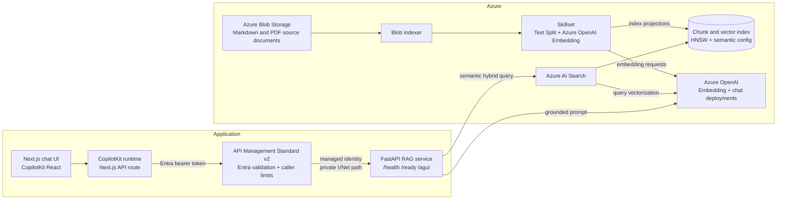
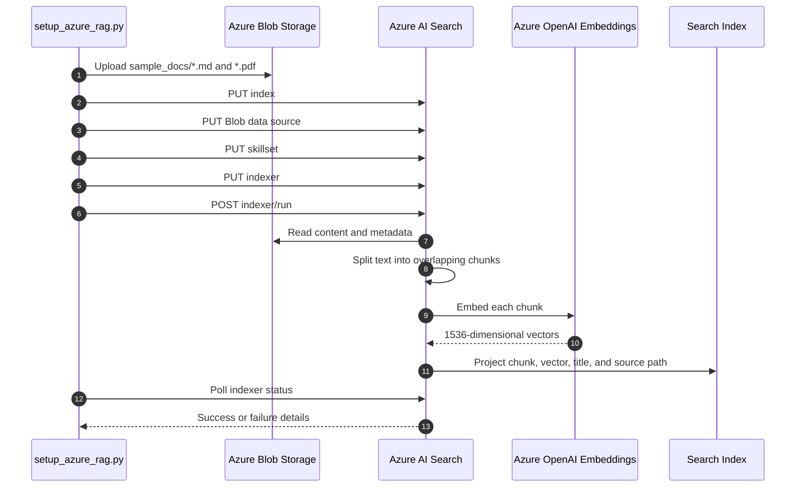
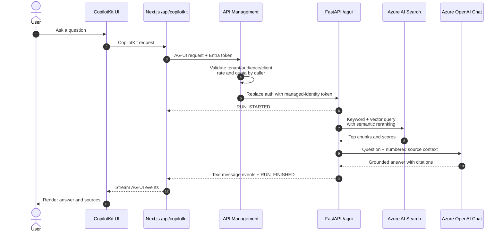

# Azure AI Search RAG Demo

An Azure-native retrieval-augmented generation (RAG) application that uses Azure AI Search for the full document retrieval pipeline: Blob ingestion, chunking, integrated embeddings, vector indexing, semantic ranking, and hybrid search. FastAPI exposes AG-UI chat and readiness for the Next.js CopilotKit UI.

Azure service-to-service access uses managed identities and least-privilege RBAC. The production topology uses API Management Standard v2 to validate Microsoft Entra tokens from the UI identity, enforce per-caller limits, and replace inbound credentials with its managed identity before reaching the private API.

## Architecture



### Indexing flow

The setup command manages every Azure AI Search object programmatically with create-or-update operations, then starts the indexer and waits for its result.



### Query flow



## Components and Features

| Component | Implementation | Responsibility | Current features |
|---|---|---|---|
| Source storage | Azure Blob Storage | Durable source-document store | Existing container support; sample Markdown/PDF upload; overwrite on rerun |
| Search index | Azure AI Search | Stores retrievable chunks and vectors | HNSW cosine vector search; 1536 dimensions; semantic configuration; filterable source metadata |
| Data source | Azure AI Search Blob data source | Connects Search to the Blob container | High-water-mark change detection based on Blob last-modified metadata |
| Skillset | Azure AI Search integrated vectorization | Enriches documents during indexing | 1,800-character page chunks; 250-character overlap; Azure OpenAI embedding skill; index projections |
| Indexer | Azure AI Search indexer | Orchestrates Blob extraction and enrichment | Content and metadata extraction; strict zero-failure policy; status polling |
| Retrieval | `azure_rag/rag.py` | Finds grounding context | Semantic hybrid search: full-text query, integrated query vectorization, HNSW candidates, semantic reranking, captions, and answers requested from Search |
| Generation | Azure OpenAI chat deployment | Produces the final answer | Agent Framework streams grounded answers; citations from `search_docs` tool results |
| API | FastAPI | Exposes UI-facing operations | Process health, readiness, Agent Framework AG-UI streaming endpoint |
| Agent runtime | Microsoft Agent Framework + AG-UI | Owns chat streaming and tool calls | Azure OpenAI agent with `search_docs` tool; AG-UI SSE via `agent-framework-ag-ui` |
| Agent protocol | AG-UI | Standardizes UI-to-agent communication | Run lifecycle, text-message lifecycle, and error events over an event stream |
| Web runtime | CopilotKit runtime in Next.js | Server-side agent bridge | `HttpAgent` proxy to FastAPI; backend URL kept server-side |
| Web UI | Next.js, React, CopilotKit | Interactive test console | Responsive chat, suggested questions, answer rendering, and source display |
| API gateway | API Management Standard v2 | Authenticated public API boundary | Tenant/audience/client validation; 30 calls per 60 seconds and 500 calls per day for `/agui`; managed-identity backend auth |
| Deployment | Bicep and Container Apps | Reproducible application infrastructure | Public UI environment, internal API environment, VNet/DNS, APIM, identities, RBAC, and policies |

## Azure Resources

The application expects these resources to exist:

| Resource | Purpose | Configured value |
|---|---|---|
| Azure AI Foundry/OpenAI resource | Hosts model deployments | `kostas-demo-rag-resource` |
| Chat deployment | Grounded answer generation | `Llama-3.3-70B-Instruct` |
| Embedding deployment | Index-time and query-time vectors | `text-embedding-3-small` |
| Azure AI Search service | Indexing and retrieval | `rag-system` |
| Storage account | Hosts source Blob container | `kostasdemoragdocs21847` |
| Blob container | Stores source documents | Set with `AZURE_STORAGE_CONTAINER` |

The setup script creates the Search index, data source, skillset, and indexer. Bicep provisions the application-facing Container Apps, VNet, private DNS, APIM, policies, and runtime RBAC. It references rather than creates the Azure resource group, Search service, Foundry/OpenAI resource, model deployments, storage account, or Blob container.

## Infrastructure

Production infrastructure is defined in `infra/main.bicep` and its focused modules. The deployment keeps the browser-facing UI public while placing FastAPI behind an internal Container Apps environment that can only be reached through API Management.

| Layer | Provisioned behavior |
|---|---|
| Public application | Next.js runs in a public Container Apps environment and uses its system-assigned identity to obtain an Entra token for APIM |
| API gateway | APIM Standard v2 validates tenant, audience, and caller identity; applies shared limits of 30 requests per minute and 500 requests per day to `/agui`; and authenticates to FastAPI with its managed identity |
| Private application | FastAPI runs in a separate VNet-injected internal Container Apps environment with Container Apps authentication restricted to the APIM identity |
| Network and DNS | Dedicated APIM and API subnets plus private DNS allow APIM to resolve and reach the internal API without exposing a public API ingress |
| Azure dependencies | Existing OpenAI, Search, and Storage resources are referenced by ID and endpoint rather than recreated |
| Identity and RBAC | The API and Search system identities receive only the data-plane and management roles required for querying, readiness, indexing, embeddings, and Blob access |

The template intentionally does not create the deployment resource group, container registry, Entra application registrations, Azure OpenAI/model deployments, Search service, storage account, or source container. These remain explicit prerequisites so deploying the application does not replace or reset existing service configuration.

Deployment uses two parameter files:

- `infra/parameters/dev.bicepparam` for development environments.
- `infra/parameters/prod.bicepparam` for production environments.

After publishing the API and UI images, deploy with:

```bash
./infra/deploy.sh <deployment-resource-group> <dev|prod> <search-resource-group> <search-service-name>
```

The deployment script safely enables the existing Search system identity, preserving any user-assigned identities, and then deploys Bicep with the same Search target. See [`infra/README.md`](infra/README.md) for image build commands, required Entra configuration, parameter descriptions, network details, role assignments, and the post-deployment smoke checklist.

## Project Structure

```text
azure_rag/
  config.py           Environment configuration and derived resource names
  search_pipeline.py  Blob upload and Azure AI Search object management
  rag.py              Hybrid retrieval, prompting, and answer generation
  api.py              FastAPI routes and request/response models
  agent.py            Agent Framework agent + search_docs tool
sample_docs/          Sample Markdown/PDF knowledge base
scripts/
  setup_azure_rag.py  Pipeline setup entry point
tests/                Backend unit tests
ui/
  src/app/            Next.js UI, provider, and CopilotKit API route
  src/lib/            Agent URL configuration and tests
main.py               Alternate setup entry point
```

## Prerequisites

- Python 3.12 or later
- [`uv`](https://docs.astral.sh/uv/) for Python dependency and command management
- Node.js compatible with Next.js 16 and npm
- An Azure subscription with the resources listed above
- An Azure AI Search tier that supports semantic ranking
- Network access between Azure AI Search and the Azure OpenAI embedding deployment
- Azure CLI, Bicep CLI, and `jq` for infrastructure deployment
- Microsoft Entra app registrations/audiences for the APIM-facing and backend APIs
- Permission to enable the Search system identity and create the documented role assignments

## Configuration

Copy `.env.example` to `.env` and provide the resource endpoints, deployment names, and Azure resource ID. No API keys or storage connection strings are required:

```env
AZURE_OPENAI_ENDPOINT=https://kostas-demo-rag-resource.openai.azure.com/openai/v1
AZURE_OPENAI_CHAT_DEPLOYMENT=Llama-3.3-70B-Instruct
AZURE_OPENAI_EMBEDDING_DEPLOYMENT=text-embedding-3-small

AZURE_SEARCH_ENDPOINT=https://rag-system.search.windows.net
AZURE_SEARCH_INDEX=kostas-demo-rag-index

AZURE_STORAGE_ACCOUNT_URL=https://kostasdemoragdocs21847.blob.core.windows.net
AZURE_STORAGE_CONTAINER=sample-docs
AZURE_STORAGE_RESOURCE_ID=/subscriptions/<subscription-id>/resourceGroups/<resource-group>/providers/Microsoft.Storage/storageAccounts/kostasdemoragdocs21847
```

`AZURE_OPENAI_ENDPOINT` accepts either the Azure OpenAI resource URL or its `/openai/v1` URL. The application derives the correct URL for chat calls and Azure AI Search integrated vectorization.

`AZURE_STORAGE_ACCOUNT_URL` is used by the setup process to upload sample documents with Microsoft Entra authentication. `AZURE_STORAGE_RESOURCE_ID` is written to the Search Blob data source as a `ResourceId=...;` connection string; it identifies the account without containing a storage secret.

Keep `.env` out of source control. The checked-in `.env.example` contains resource names and placeholders only.

## Authentication

The application and setup command use `DefaultAzureCredential`. In Azure, configure a system-assigned or user-assigned managed identity on the application host. For local development, sign in with a supported developer credential such as Azure CLI (`az login`); `DefaultAzureCredential` selects the available identity automatically.

Azure OpenAI calls use the v1 endpoint and a bearer-token provider for `https://cognitiveservices.azure.com/.default`. Azure AI Search data-plane and management REST calls request `https://search.azure.com/.default`. Blob uploads pass the same token credential directly to `BlobServiceClient`.

Azure AI Search itself uses its system-assigned managed identity for two indexing-time dependencies: reading the Blob data source and calling Azure OpenAI for vectorization and the embedding skill. The vectorizer and skillset deliberately omit both `apiKey` and `authIdentity`; omission selects the Search service's system-assigned identity.

## RBAC

Assign only the roles needed by each identity:

| Identity | Resource scope | Required role | Purpose |
|---|---|---|---|
| Application/setup managed identity | Azure AI Search service | `Search Index Data Reader` | Run retrieval queries against the index |
| Runtime API managed identity | Azure AI Search service | `Search Service Contributor` | Read indexer status for `/ready` |
| Setup managed identity | Azure AI Search service | `Search Service Contributor` | Create and update indexes, data sources, skillsets, and indexers |
| Setup managed identity | Storage account or source container | `Storage Blob Data Contributor` | Create the container when needed and upload sample documents |
| Azure AI Search system-assigned identity | Storage account or source container | `Storage Blob Data Reader` | Read source documents during indexing |
| Application/setup managed identity | Azure OpenAI resource | `Cognitive Services OpenAI User` | Generate grounded chat answers |
| Azure AI Search system-assigned identity | Azure OpenAI resource | `Cognitive Services OpenAI User` | Run query-time vectorization and index-time embedding |

If the runtime and setup command use separate managed identities, do not grant the runtime identity the setup-only contributor roles. Role assignments can take several minutes to propagate.

## Install

Backend dependencies are locked in `uv.lock`:

```bash
uv sync
```

UI dependencies are pinned in `ui/package-lock.json`:

```bash
cd ui
npm ci
cd ..
```

## Create or Update the Search Pipeline

Run from the repository root:

```bash
uv run python scripts/setup_azure_rag.py
```

Equivalent entry point:

```bash
uv run python main.py
```

The command is designed to be rerunnable. It:

1. Uploads `sample_docs/*.md` and `sample_docs/*.pdf` to the configured Blob container.
2. Creates or updates the vector and semantic index.
3. Creates or updates the Blob data source.
4. Creates or updates the split-and-embed skillset.
5. Creates or updates the indexer.
6. Runs the indexer and polls for up to three minutes.

Resource names are derived from `AZURE_SEARCH_INDEX`:

| Object | Name pattern |
|---|---|
| Index | `<AZURE_SEARCH_INDEX>` |
| Semantic configuration | `<AZURE_SEARCH_INDEX>-semantic` |
| Data source | `<AZURE_SEARCH_INDEX>-blob-datasource` |
| Skillset | `<AZURE_SEARCH_INDEX>-skillset` |
| Indexer | `<AZURE_SEARCH_INDEX>-indexer` |

## Run the Application

Start the API in terminal 1:

```bash
uv run uvicorn azure_rag.api:app --reload
```

Start the UI in terminal 2:

```bash
cd ui
npm run dev
```

Open [http://localhost:3000](http://localhost:3000). FastAPI documentation is at [http://127.0.0.1:8000/docs](http://127.0.0.1:8000/docs).

The UI defaults to `http://127.0.0.1:8000/agui`. To use another API URL, create `ui/.env.local`:

```env
AGENT_URL=https://your-api.example.com/agui
APIM_SCOPE=api://your-apim-app-id/.default
# Optional when readiness is not AGENT_URL with terminal /agui replaced by /ready:
READY_URL=https://your-api.example.com/ready
```

The Next.js server uses `DefaultAzureCredential` to acquire an APIM token for `APIM_SCOPE`; the scope must end in `/.default`. This supports Container Apps managed identity and the local Azure developer credential chain. `AGENT_URL`, `READY_URL`, credentials, and bearer tokens remain server-side. The browser only calls same-origin Next.js routes. The UI polls readiness every 30 seconds and enables chat only while the backend reports `ready`.

## API

### `GET /health`

Returns the stable, unauthenticated process-liveness response `{"status":"ok"}`. This endpoint makes no Azure calls.

```bash
curl http://127.0.0.1:8000/health
```

### `GET /ready`

Checks Azure AI Search and Azure OpenAI using managed identity. The response includes the index document count and normalized latest indexer result. Independent probes have a five-second aggregate deadline, and results are cached for 30 seconds.

It returns HTTP 200 with `ready` when dependencies work and documents are present, HTTP 200 with `degraded` for a failed historical indexer run, or HTTP 503 with `unavailable` when a dependency fails/times out or the index is empty.

```json
{
  "status": "ready",
  "search": {
    "status": "available",
    "document_count": 42,
    "indexer": {
      "status": "success",
      "started_at": "2026-01-01T00:00:00Z",
      "ended_at": "2026-01-01T00:01:00Z",
      "error": null
    },
    "error": null
  },
  "openai": {"status": "available", "error": null}
}
```

### `POST /agui`

Served by Microsoft Agent Framework's AG-UI bridge (`agent-framework-ag-ui`). The agent streams model tokens over AG-UI events and calls a `search_docs` tool that wraps Azure AI Search retrieval. CopilotKit consumes those deltas out of the box.

```bash
curl -N -X POST http://127.0.0.1:8000/agui \
  -H "Content-Type: application/json" \
  -H "Accept: text/event-stream" \
  -d '{
    "threadId": "demo-thread",
    "runId": "demo-run",
    "state": {},
    "messages": [{
      "id": "msg-1",
      "role": "user",
      "content": "What maintenance does the product manual recommend?"
    }],
    "tools": [],
    "context": [],
    "forwardedProps": {}
  }'
```

## Test and Verify

```bash
uv run pytest
cd ui
npm test
npm run lint
npm run build
```

The unit tests mock external calls. A live Azure deployment, RBAC-propagation wait, setup-script run, authenticated APIM smoke test, and private-network/DNS verification remain external checks and can incur Azure usage charges. See [`infra/README.md`](infra/README.md) for deployment and smoke-test commands.

## Current Scope and Limitations

- APIM authenticates the deployed UI workload identity/application. Interactive end-user identity, per-user authorization, and tenant/document ACL enforcement are not implemented.
- Bicep provisions the application network, Container Apps, APIM, identities, policies, and RBAC. Search, OpenAI/model deployments, Storage, Entra app registrations, and the deployment resource group remain prerequisites.
- Indexing is manually triggered and has no recurring schedule.
- The index schema is specialized for extracted text; there is no layout-aware PDF, image, table, or OCR processing.
- Retrieval has no tenant, user, ACL, or metadata filters.
- `/agui` is the only chat endpoint and is hosted by Agent Framework AG-UI streaming; the agent decides when to call `search_docs`.
- Client disconnect cancellation of upstream generation is not implemented yet.
- The liveness endpoint is process-only; `/ready` performs cached downstream readiness probes.
- APIM rate-limits and quotas `/agui`; application-level retry policy, circuit breaker, response cache, evaluation harness, and telemetry remain outstanding.
- The project uses the preview Azure AI Search API version configured in `AppConfig`; preview contracts can change.

## Production Roadmap

### Delivered

- APIM and Entra workload authentication protect `/agui` and `/ready`; APIM applies a shared 30-request/minute rate limit and 500-request/day quota to AG-UI traffic.
- Managed identities replace application API keys for OpenAI, Search, and Storage. Search-integrated vectorization, skillsets, and Blob ingestion are also keyless.
- `/health` provides process liveness, while cached `/ready` probes Search document count, OpenAI availability, and the latest indexer result with correct 200/503 semantics.
- The UI reports live readiness and indexer status, removes stale connection state, and gates chat until dependencies are ready.
- Bicep and deployment scripts define the split public/private Container Apps topology, APIM Standard v2 integration, private DNS, Easy Auth, identities, and RBAC.
- Backend, UI, APIM-policy, deployment-script, and generated-infrastructure behavior have local automated coverage.

### Next

| Priority | Addition | Exit criterion |
|---|---|---|
| P0 | Live Azure deployment and automated smoke suite | Prove VNet integration, private DNS, Easy Auth, RBAC propagation, managed-identity calls, readiness, and APIM throttling in the target subscription |
| P0 | Interactive user authentication, per-user authorization, and request-size limits | Human users sign in; authorization and quotas are attributable to a user or tenant rather than only the UI workload |
| P0 | Private endpoints for Search, OpenAI, Storage, and the image registry | Every dependency is reachable only through approved private network paths, including managed-identity image pulls |
| P1 | Scheduled ingestion, deletion handling, dead-letter workflow, and alerting | Content stays synchronized automatically and failed documents produce actionable alerts |
| P1 | Application Insights and OpenTelemetry | Dashboards expose retrieval/generation latency, token use, dependency failures, empty results, and readiness history |
| P1 | Resilience controls | Retries, backoff, circuit breaking, and concurrency limits handle Azure throttling without cascading failures |
| P1 | Document ACL and tenant filters | Search enforces tenant/user access constraints before chunks reach the model |
| P1 | Evaluation datasets and CI gates | CI tracks retrieval recall, groundedness, citation correctness, latency, and cost against explicit thresholds |
| P1 | Client cancellation | Disconnects cancel upstream Agent Framework / OpenAI generation |
| P2 | Layout-aware document ingestion | PDFs, scans, forms, tables, and images are processed through Document Intelligence or Content Understanding |
| P2 | Richer source metadata | Responses expose semantic captions/answers and useful document/page locations |
| P2 | Conversation persistence and feedback | Multi-turn state, audit history, and user feedback survive individual requests |
| P2 | Caching and duplicate-content detection | Repeated embedding, retrieval, and generation work is measurably reduced |

## Design Notes

- Azure AI Search performs both index-time and query-time vectorization with the same embedding deployment, avoiding embedding logic in the application.
- Hybrid retrieval combines lexical matching with vector similarity, then applies semantic reranking before generation.
- Index projections create one searchable document per chunk and skip indexing the unsplit parent document.
- The answer prompt includes numbered chunks, prior conversation turns from the current thread, and citation markers such as `[1]` and `[2]` for knowledge-base facts.
- The CopilotKit runtime is a server-side boundary between the browser and the AG-UI agent endpoint; streaming is owned by Agent Framework on `/agui`, not by custom token loops in this repo.
