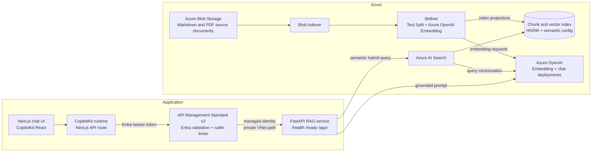
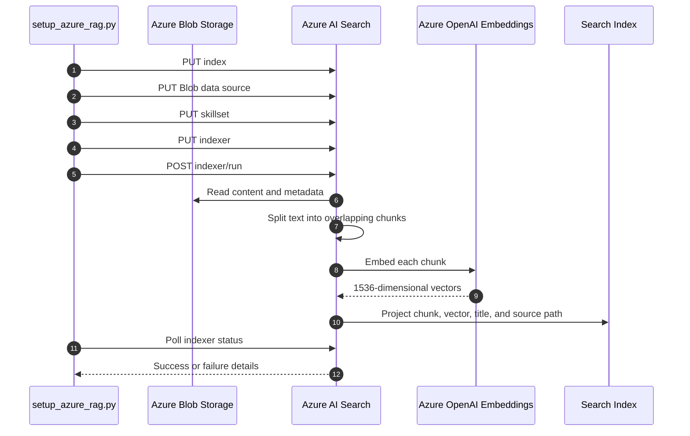
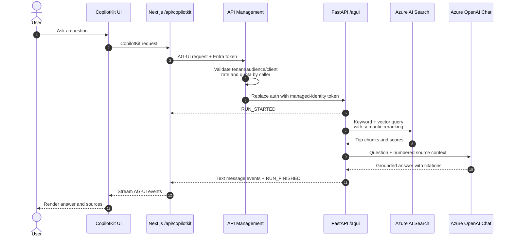

# Architecture

This document expands the production topology, indexing flow, query flow, components, Azure resources, and infrastructure boundaries for the Azure RAG system.

## System Architecture



### Indexing flow

The setup command manages every Azure AI Search object programmatically with create-or-update operations, then starts the indexer and waits for its result.



### Query flow



## Components and Features

| Component | Implementation | Responsibility | Current features |
|---|---|---|---|
| Source storage | Azure Blob Storage | Durable per-user source-document store | Authenticated Markdown/PDF upload under the caller's user ID; overwrite on re-upload |
| Search index | Azure AI Search | Stores retrievable chunks and vectors | HNSW cosine vector search; 1536 dimensions; semantic configuration; filterable source metadata |
| Data source | Azure AI Search Blob data source | Connects Search to the Blob container | High-water-mark change detection based on Blob last-modified metadata |
| Skillset | Azure AI Search integrated vectorization | Enriches documents during indexing | 1,800-character page chunks; 250-character overlap; Azure OpenAI embedding skill; index projections |
| Indexer | Azure AI Search indexer | Orchestrates Blob extraction and enrichment | Content and metadata extraction; strict zero-failure policy; status polling |
| Retrieval | `azure_rag/rag.py` | Finds per-user grounding context | Semantic hybrid search with a mandatory caller-owned `user_id` filter, integrated query vectorization, HNSW candidates, semantic reranking, captions, and answers requested from Search |
| Generation | Azure OpenAI chat deployment | Produces answers and follow-ups | Agent Framework streams grounded answers; one-shot structured generation returns at most three discussion follow-ups |
| API | FastAPI | Exposes UI-facing operations | Process health, readiness, one-shot discussion suggestions, Agent Framework AG-UI streaming endpoint |
| Agent runtime | Microsoft Agent Framework + AG-UI | Owns chat streaming and tool calls | Azure OpenAI agent with `search_docs` tool; AG-UI SSE via `agent-framework-ag-ui` |
| Agent protocol | AG-UI | Standardizes UI-to-agent communication | Run lifecycle, text-message lifecycle, and error events over an event stream |
| Web runtime | CopilotKit runtime in Next.js | Server-side agent bridge | `HttpAgent` proxy to FastAPI; backend URL kept server-side |
| Web UI | Next.js, React, CopilotKit | Interactive test console | Responsive chat, one-shot cached follow-up suggestions, answer rendering, and source display |
| API gateway | API Management Standard v2 | Authenticated public API boundary | Tenant/audience/client validation; 30 calls per 60 seconds and 500 calls per day for `/agui`; managed-identity backend auth |
| Deployment | Bicep and Container Apps | Reproducible application infrastructure | Public UI environment, internal API environment, VNet/DNS, APIM, identities, RBAC, and policies |

## Azure Resources

The application expects these resources to exist:

| Resource | Purpose | Configured value |
|---|---|---|
| Azure AI Foundry/OpenAI resource | Hosts model deployments | `<openai-resource>` |
| Chat deployment | Grounded answer generation | `Llama-3.3-70B-Instruct` |
| Embedding deployment | Index-time and query-time vectors | `text-embedding-3-small` |
| Azure AI Search service | Indexing and retrieval | `rag-system` |
| Storage account | Hosts source Blob container | `<storage-account>` |
| Blob container | Stores source documents | Set with `AZURE_STORAGE_CONTAINER` |

The setup script creates the Search index, data source, skillset, and indexer. Bicep provisions the application-facing Container Apps, VNet, private DNS, APIM, policies, and runtime RBAC. It references rather than creates the Azure resource group, Search service, Foundry/OpenAI resource, model deployments, storage account, or Blob container.

## Infrastructure

Production infrastructure is defined in `infra/main.bicep` and its focused modules. The deployment keeps the browser-facing UI public while placing FastAPI behind an internal Container Apps environment that can only be reached through API Management.

| Layer | Provisioned behavior |
|---|---|
| Public application | Next.js runs in a public Container Apps environment and uses its system-assigned identity to obtain an Entra token for APIM |
| API gateway | APIM Standard v2 validates tenant, audience, and caller identity; applies shared limits of 30 requests per minute and 500 requests per day to `/agui`; and authenticates to FastAPI with its managed identity |
| Private application | FastAPI runs in a separate VNet-injected internal Container Apps environment with Container Apps authentication restricted to the APIM identity |
| Network and DNS | Dedicated APIM and API subnets plus private DNS allow APIM to resolve and reach the internal API without exposing a public API ingress |
| Azure dependencies | Existing OpenAI, Search, and Storage resources are referenced by ID and endpoint rather than recreated |
| Identity and RBAC | The API and Search system identities receive only the data-plane and management roles required for querying, readiness, indexing, embeddings, and Blob access |

The runtime template intentionally does not create the deployment resource group, container registry, Entra application registrations, Azure OpenAI/model deployments, Search service, storage account, or source container. These remain explicit prerequisites so deploying the application does not replace or reset existing service configuration.

For an empty subscription, `infra/bootstrap.bicep` provides a greenfield bootstrap for the Azure resources that can be safely managed by ARM/Bicep: resource group, ACR, Storage/container, Azure AI Search, Azure OpenAI, model deployments, managed-identity ACR pulls, and setup/indexing RBAC. It still leaves Entra app registrations and the post-deploy UI auth redirect/federated credential as explicit tenant-level steps.

Deployment uses two parameter files:

- `infra/parameters/dev.bicepparam` for development environments.
- `infra/parameters/prod.bicepparam` for production environments.

After publishing the API and UI images, deploy with:

```bash
./infra/deploy.sh <deployment-resource-group> <dev|prod> <search-resource-group> <search-service-name>
```

The deployment script safely enables the existing Search system identity, preserving any user-assigned identities, and then deploys Bicep with the same Search target. See [`infra/README.md`](../infra/README.md) for image build commands, required Entra configuration, parameter descriptions, network details, role assignments, and the post-deployment smoke checklist.

Greenfield bootstrap preview and deploy:

```bash
./infra/bootstrap.sh dev switzerlandnorth --what-if
./infra/bootstrap.sh dev switzerlandnorth
```
